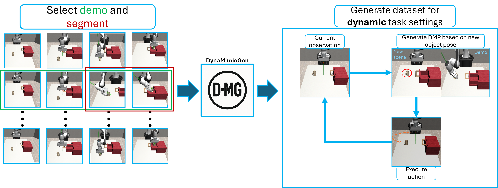
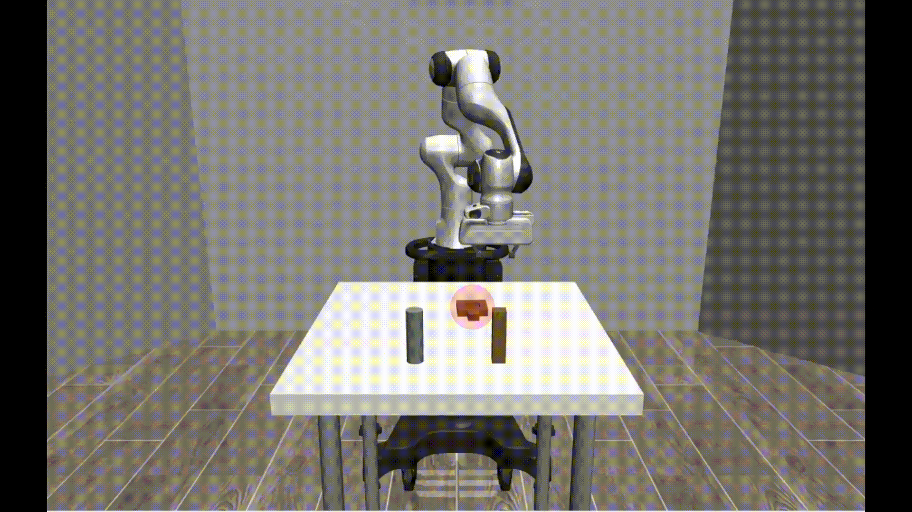
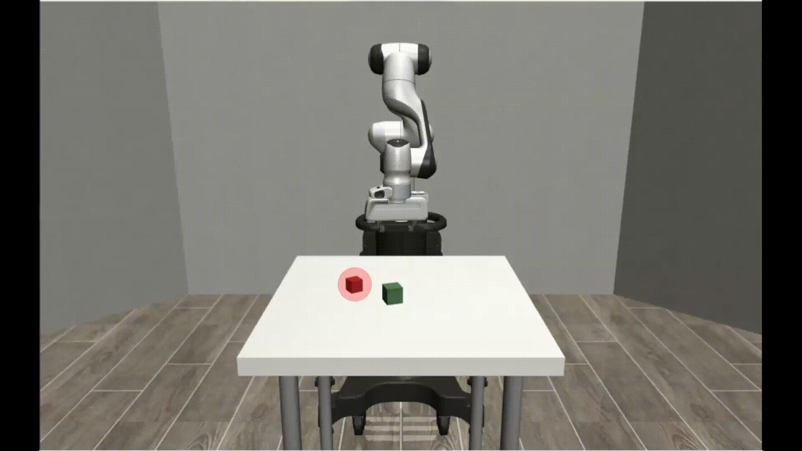
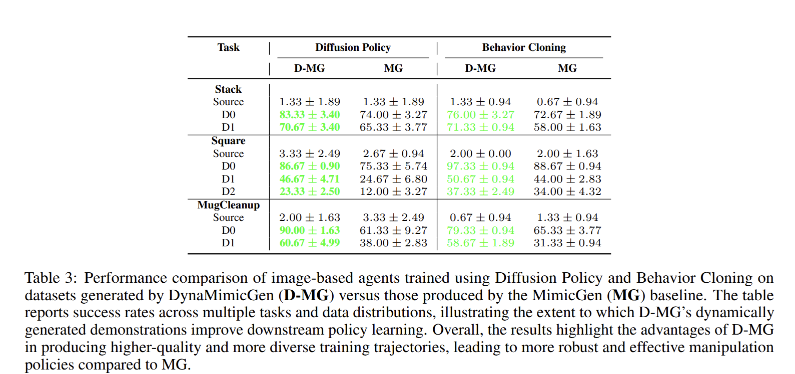

# DynaMimicGen: A Data Generation Framework for Robot Learning of Dynamic Tasks

<p align="center">
  <a href="https://github.com/automation-robotics-machines/DynaMimicGen">
    
  </a>
  <a href="https://arxiv.org/abs/2511.16223">
    
  </a>
</p>

<p align="center">
  
</p> 

## Overview  
Learning robust robot manipulation policies typically requires large and diverse datasets — yet collecting such datasets is expensive, time-consuming, and especially challenging in **dynamic environments**, where object poses, obstacles, and scene configurations may change unpredictably.

**DynaMimicGen (D-MG)** is a scalable dataset generation framework designed to overcome this bottleneck. Starting from only a **few human demonstrations**, D-MG:

1. **Automatically segments demonstrations** into meaningful sub-tasks.  
2. **Uses Dynamic Movement Primitives (DMPs)** to adapt demonstrated motions to new and unseen environments.  
3. **Generates smooth, realistic, task-consistent Cartesian trajectories** that react in real time to changes in object poses, robot states, and scene geometry.

Unlike prior approaches that assume static setups or rely on simple trajectory interpolation, **D-MG is explicitly built for dynamic manipulation tasks**, enabling robust trajectory adaptation across variations in:

- Scene layouts  
- Object instances  
- Robot configurations  
- Dynamic or unpredictable environment changes  

Imitation-learning agents trained solely on D-MG-generated datasets achieve strong performance on **long-horizon, contact-rich tasks**, such as dynamic cube stacking or placing mugs into drawers — even when the environment changes during execution.

Overall, D-MG reduces human supervision requirements and paves the way toward **scalable, autonomous robot learning in dynamic real-world settings**.

---

## Authors  
- **Vincenzo Pomponi** – SUPSI, vincenzo.pomponi@supsi.ch  
- **Paolo Franceschi** – SUPSI, paolo.franceschu@supsi.ch  
- **Stefano Baraldo** – SUPSI, stefano.baraldo@supsi.ch  
- **Loris Roveda** – SUPSI, loris.roveda@supsi.ch · PoliMi, loris.roveda@mail.polimi.it  
- **Oliver Avram** – SUPSI, oliver.avram@supsi.ch  
- **Luca Maria Gambardella** – USI, luca.gambardella@usi.ch  
- **Anna Valente** – SUPSI, anna.valente@supsi.ch  

---

## Publication & Code  
- 📄 **Paper (arXiv):** https://arxiv.org/abs/2511.16223  
- 💻 **Code Repository:** https://github.com/automation-robotics-machines/DynaMimicGen  

---

## Highlights  
- ✅ **Generates large-scale datasets from minimal human demonstrations**  
- ✅ **Explicitly designed for dynamic and unpredictable task settings**  
- ✅ **Generalizes to new scene layouts, objects, and robot configurations**  
- ✅ **Produces smooth, realistic, and DMP-driven Cartesian trajectories**  
- ✅ **Enables strong imitation-learning performance on long-horizon tasks**  

---

## Supported Tasks & Benchmarks  
More tasks will be added soon.

<p align="center">
  
  
  
</p>

---

## Results  
<p align="center">
  
</p>

---

## Citation
If you use **DynaMimicGen (D-MG)** or this code, please cite the paper:

```bibtex
@article{pomponi2025dynamimicgen,
  title={DynaMimicGen: A Data Generation Framework for Robot Learning of Dynamic Tasks},
  author={Pomponi, Vincenzo and Franceschi, Paolo and Baraldo, Stefano and Roveda, Loris and Avram, Oliver and Gambardella, Luca Maria and Valente, Anna},
  journal={arXiv preprint arXiv:2511.16223},
  year={2025}
}
```
