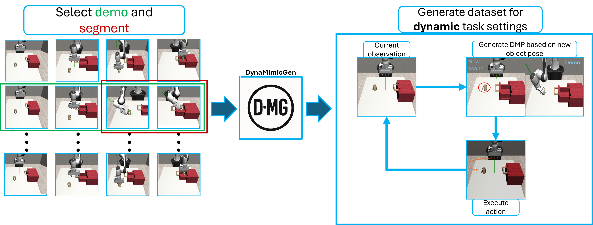
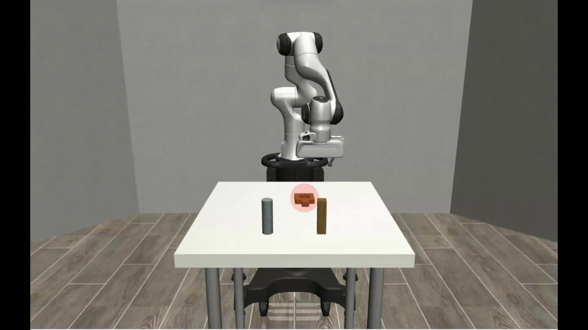
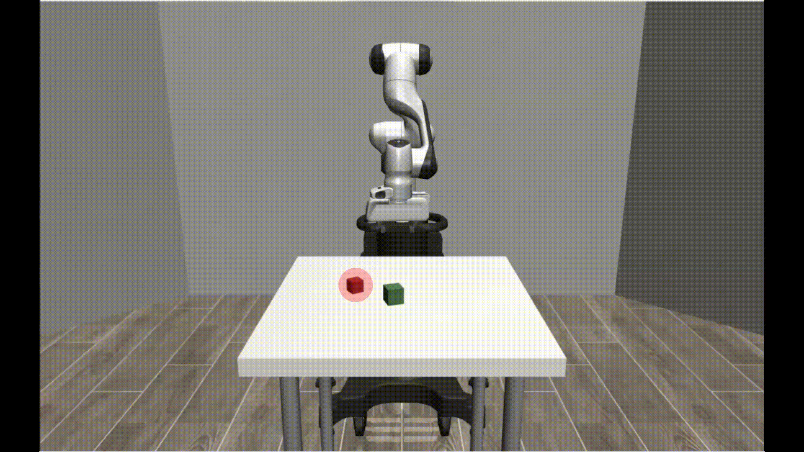
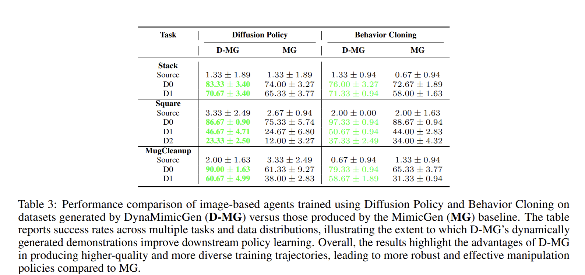

# DynaMimicGen: A Data Generation Framework for Robot Learning of Dynamic Tasks

> Companion GitHub repository for the paper **“DynaMimicGen: A Data Generation Framework for Robot Learning of Dynamic Tasks.”**  
> This repository hosts **dataset generation pipelines, trajectory adaptation modules, Dynamic Movement Primitive utilities, and benchmark experiments** to reproduce the results from the paper.

<p align="center">
  <a href="#citation"></a>
  <a href="#getting-started"></a>
  <a href="https://github.com/automation-robotics-machines/DynaMimicGen"></a>
  <a href="https://arxiv.org/abs/2511.16223"></a>
  
</p>

<p align="center">
  
</p>

---

## 📖 Overview

Learning robust robot manipulation policies requires **large, diverse, and task-consistent datasets**.  
However, collecting such datasets through human teleoperation or kinesthetic teaching is expensive, slow, and becomes particularly challenging when dealing with **dynamic environments**, where:

- object poses continuously vary,
- obstacles may appear or move,
- robot initial conditions change,
- and execution-time perturbations are common.

**DynaMimicGen (D-MG)** addresses this bottleneck by providing a scalable framework for **automatic dataset generation from only a few human demonstrations**.

Starting from sparse demonstrations, D-MG:

- automatically segments manipulation trajectories into reusable sub-tasks,
- adapts each sub-task using **Dynamic Movement Primitives (DMPs)**,
- regenerates smooth Cartesian trajectories for unseen scenes,
- and produces large-scale imitation datasets for dynamic long-horizon robotic manipulation.

Unlike previous mimic-generation approaches designed mainly for static environments, **D-MG is explicitly built for dynamic tasks**, enabling real-time trajectory adaptation under:

- changing scene layouts,
- novel object configurations,
- moving obstacles,
- varying robot states,
- dynamic execution perturbations.

This enables imitation-learning agents to train on highly diverse synthetic demonstrations while requiring **minimal human supervision**.

---

## ✨ Key Highlights

- ✅ Generates large-scale robot datasets from only a few demonstrations  
- ✅ Explicitly designed for **dynamic and unpredictable environments**  
- ✅ Dynamic Movement Primitive based trajectory adaptation  
- ✅ Smooth, realistic, and task-consistent Cartesian motion generation  
- ✅ Generalizes across objects, scene layouts, and robot initializations  
- ✅ Enables strong imitation learning performance on long-horizon contact-rich tasks  

---

## 📂 Repository Structure

```bash
.
├── bash/                                             # Bash files with extensions .sh
├── configs/                                          # Configuration files to train Behavior Cloning and Diffusion Policy agents
├── demos/                                            # Directory to host generated human and synthetic demonstrations
├── dmp/                                              # Code to implement DMPs-based robot trajectory control
├── scripts/
│   ├── annotate_subtasks.py                          # Automatic subtask annotation
│   ├── collect_human_demonstrations.py               # Script to collect human demonstration in simulation with a spacemouse
│   ├── filter_dataset.py                             # Automatic discard a selected number of trajectories in a hdf5 dataset
│   ├── playback_human_demonstrations.py              # Visualize the acquired/generated trajectory
│   ├── print_hdf5_dataset.py                         # Analyze the internal structure and contents of a hdf5 dataset
│   └── visualize_dataaset_imgs.py                    # Visualize the images within a hdf5 dataset
├── utils/
│   ├── hdf5_utils.py                                 # Utils to handle hdf5 files
│   ├── math_utils.py                                 # Utils for mathematical functions
│   ├── plot_utils.py                                 # Utils to plot
│   ├── task_utils.py                                 # Utils to handle task and skill composition
│   └── transform_utils.py                            # Utils to handle angle tansformations
├── setup.py                                          # Setup file to setup the environment
└── README.md
```
---

## Authors  
- [**Vincenzo Pomponi**](https://scholar.google.com/citations?user=ACuxQloAAAAJ&hl=it)  
- [**Paolo Franceschi**](https://scholar.google.com/citations?user=Trwj5FIAAAAJ&hl=it)
- [**Stefano Baraldo**](https://scholar.google.com/citations?hl=it&user=fnI9W58AAAAJ&view_op=list_works&sortby=pubdate)
- [**Loris Roveda**](https://scholar.google.com/citations?user=3un_pPgAAAAJ&hl=en)
- **Oliver Avram**
- [**Luca Maria Gambardella**](https://scholar.google.ch/citations?hl=en&user=SCCwW3YAAAAJ&view_op=list_works)
- [**Anna Valente**](https://scholar.google.com/citations?user=pO9TbIMAAAAJ&hl=en)

---

## Acknowledgments & Funding
- **Horizon Europe — FLUENTLY** (Grant **101058680**)
- We thank all participants and the technical staff who supported the acquisition campaign.

---

## Supported Tasks & Benchmarks  
More tasks will be added soon.

<p align="center">
  
  
  
</p>

---

## Results  
<p align="center">
  
</p>

---

## Citation
If you use **DynaMimicGen (D-MG)** or this code, please cite the paper:

```bibtex
@article{pomponi2025dynamimicgen,
  title={DynaMimicGen: A Data Generation Framework for Robot Learning of Dynamic Tasks},
  author={Pomponi, Vincenzo and Franceschi, Paolo and Baraldo, Stefano and Roveda, Loris and Avram, Oliver and Gambardella, Luca Maria and Valente, Anna},
  journal={arXiv preprint arXiv:2511.16223},
  year={2025}
}
```

## Contact
- Lead contact: **vincenzo.pomponi@supsi.ch**
- Issues & questions: please open a GitHub issue.

---

*Maintainers:* Vincenzo Pomponi.
