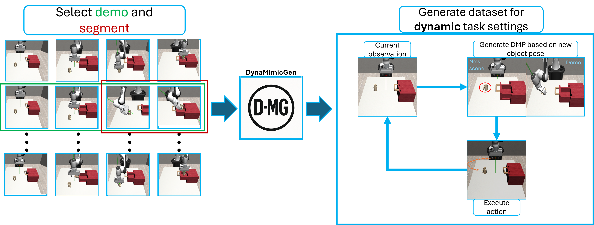
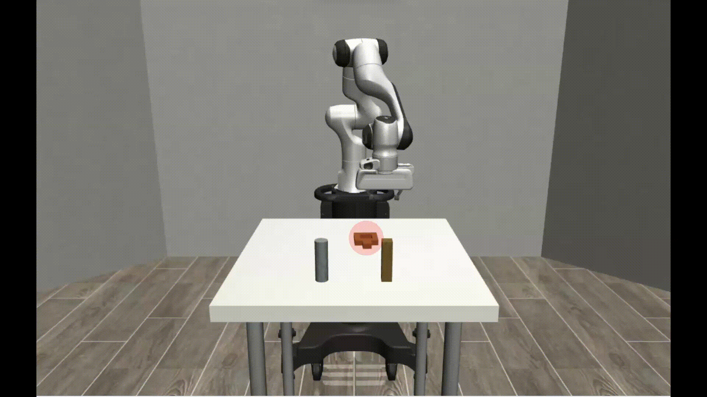
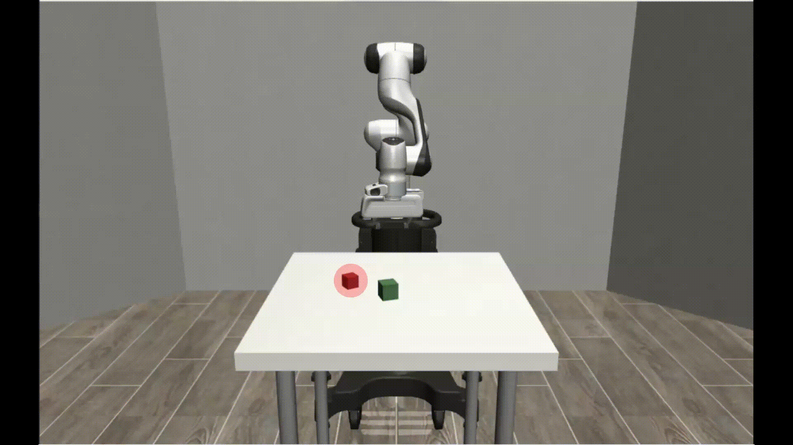
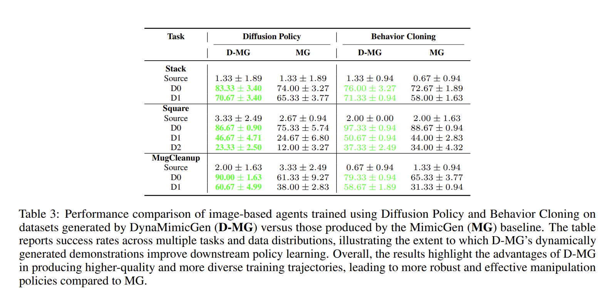

# DynaMimicGen: Data Generation for Robot Learning, Imitation Learning, and Dynamic Manipulation

> Project website of the paper **"DynaMimicGen: A Data Generation Framework for Robot Learning of Dynamic Tasks"**.
>
> DynaMimicGen is an open-source framework for generating large-scale robotic manipulation datasets from only a few human demonstrations. The framework combines **Dynamic Movement Primitives (DMPs)**, **trajectory adaptation**, and **imitation learning** to create diverse synthetic demonstrations for robot learning in dynamic environments.

<p align="center">
  <a href="#citation"></a>
  <a href="#getting-started"></a>
  <a href="https://github.com/automation-robotics-machines/DynaMimicGen"></a>
  <a href="https://arxiv.org/abs/2511.16223"></a>
  <a href="https://ieeexplore.ieee.org/document/11568504"></a>
  
</p>

<p align="center">
  
</p>

<p align="center">
  <em>
  Figure 1. Overview of the DynaMimicGen framework for robotic demonstration generation and trajectory adaptation using Dynamic Movement Primitives.
  </em>
</p>

---

## 🚀 Introduction

DynaMimicGen is a framework for generating large-scale robotic manipulation datasets from a limited number of demonstrations. The method decomposes demonstrations into reusable subtasks, adapts them using Dynamic Movement Primitives (DMPs), and synthesizes new trajectories for unseen dynamic environments. The generated datasets can be used to train imitation learning methods such as Behavior Cloning and Diffusion Policies, significantly reducing the need for expensive human data collection.

Unlike existing mimic-generation approaches primarily designed for static scenes, DynaMimicGen explicitly targets dynamic manipulation scenarios involving changing object configurations, moving obstacles, varying robot states, and execution-time perturbations.

---

## 🔑 Keywords

Robot Learning • Imitation Learning • Learning from Demonstration • Diffusion Policy • Behavior Cloning • Dynamic Manipulation • Dynamic Movement Primitives • DMP • Robotics Dataset Generation • Synthetic Demonstrations • Data Augmentation • Robot Manipulation • Long-Horizon Tasks • Foundation Models for Robotics

---

## 📖 Overview

Learning robust robot manipulation policies requires large, diverse, and task-consistent datasets.

However, collecting demonstrations through teleoperation or kinesthetic teaching is expensive, time-consuming, and difficult to scale, particularly for dynamic environments where:

* object poses continuously vary,
* obstacles appear or move,
* robot initial conditions change,
* execution-time perturbations occur frequently.

**DynaMimicGen (D-MG)** addresses this challenge by enabling scalable dataset generation from only a handful of human demonstrations.

Starting from sparse demonstrations, D-MG:

* automatically segments manipulation trajectories into reusable subtasks,
* adapts subtasks using Dynamic Movement Primitives,
* regenerates smooth Cartesian trajectories for unseen environments,
* produces large-scale synthetic datasets for robot learning.

The framework is specifically designed for dynamic tasks involving:

* changing scene layouts,
* novel object configurations,
* moving obstacles,
* varying robot states,
* dynamic execution perturbations.

This enables imitation-learning policies to train on diverse synthetic demonstrations while minimizing human supervision and data collection effort.

---

## ✨ Key Contributions

* ✅ Generates large-scale robotic manipulation datasets from only a few demonstrations
* ✅ Explicitly designed for dynamic and unpredictable environments
* ✅ Dynamic Movement Primitive (DMP) based trajectory adaptation
* ✅ Smooth, realistic, and task-consistent Cartesian motion generation
* ✅ Generalizes across objects, scene layouts, and robot initializations
* ✅ Enables strong imitation learning performance on long-horizon manipulation tasks
* ✅ Reduces expensive human demonstration collection
* ✅ Compatible with Behavior Cloning and Diffusion Policy training pipelines

---

## 🧪 Supported Tasks & Benchmarks

Additional tasks and benchmarks will be released in future updates.

<p align="center">
  
  
  
</p>

---

## 📊 Experimental Results

<p align="center">
  
</p>

<p align="center">
  <em>
  Quantitative evaluation of DynaMimicGen-generated datasets across dynamic robotic manipulation benchmarks.
  </em>
</p>

---

## 📂 Repository Structure

```bash
.
├── bash/
│   └── *.sh
├── configs/
│   └── Training configurations
├── demos/
│   └── Human and generated demonstrations
├── dmp/
│   └── Dynamic Movement Primitive implementation
├── scripts/
│   ├── annotate_subtasks.py
│   ├── collect_human_demonstrations.py
│   ├── filter_dataset.py
│   ├── playback_human_demonstrations.py
│   ├── print_hdf5_dataset.py
│   └── visualize_dataset_imgs.py
├── utils/
│   ├── hdf5_utils.py
│   ├── math_utils.py
│   ├── plot_utils.py
│   ├── task_utils.py
│   └── transform_utils.py
├── setup.py
└── README.md
```

---

## 👥 Authors 
- [**Vincenzo Pomponi**](https://scholar.google.com/citations?user=ACuxQloAAAAJ&hl=it)  
- [**Paolo Franceschi**](https://scholar.google.com/citations?user=Trwj5FIAAAAJ&hl=it)
- [**Stefano Baraldo**](https://scholar.google.com/citations?hl=it&user=fnI9W58AAAAJ&view_op=list_works&sortby=pubdate)
- [**Loris Roveda**](https://scholar.google.com/citations?user=3un_pPgAAAAJ&hl=en)
- **Oliver Avram**
- [**Luca Maria Gambardella**](https://scholar.google.ch/citations?hl=en&user=SCCwW3YAAAAJ&view_op=list_works)
- [**Anna Valente**](https://scholar.google.com/citations?user=pO9TbIMAAAAJ&hl=en)

---

## 🙏 Acknowledgments & Funding

* **Horizon Europe — FLUENTLY** (Grant No. 101058680)

We thank all collaborators, participants, and technical staff who supported the data acquisition and experimental campaigns.

---

## 📚 Citation

If you use **DynaMimicGen (D-MG)** in your research, please cite:

```bibtex
@ARTICLE{11568504,
  author={Pomponi, Vincenzo and Franceschi, Paolo and Baraldo, Stefano and Avram, Oliver and Roveda, Loris and Gambardella, Luca Maria and Valente, Anna},
  journal={IEEE Robotics and Automation Letters}, 
  title={DynaMimicGen: A Data Generation Framework for Robot Learning of Dynamic Tasks}, 
  year={2026},
  volume={},
  number={},
  pages={1-8},
  keywords={Magnesium;Robots;Trajectory;Data collection;Training;Learning (artificial intelligence);End effectors;Cloning;Stacking;Imitation learning;Imitation Learning;Learning from Demonstration;Deep Learning in Grasping and Manipulation},
  doi={10.1109/LRA.2026.3703978}}
```

---

## 📬 Contact

* Lead Contact: **[vincenzo.pomponi@supsi.ch](mailto:vincenzo.pomponi@supsi.ch)**
* Questions and bug reports: open a GitHub Issue
* Organization Website: https://automation-robotics-machines.github.io/

---

## ⭐ Star the Repository

If you find DynaMimicGen useful for your research, consider giving the repository a star ⭐ and citing the paper. This helps increase the visibility of the project and supports future development.

---

*Maintainer: Vincenzo Pomponi*

